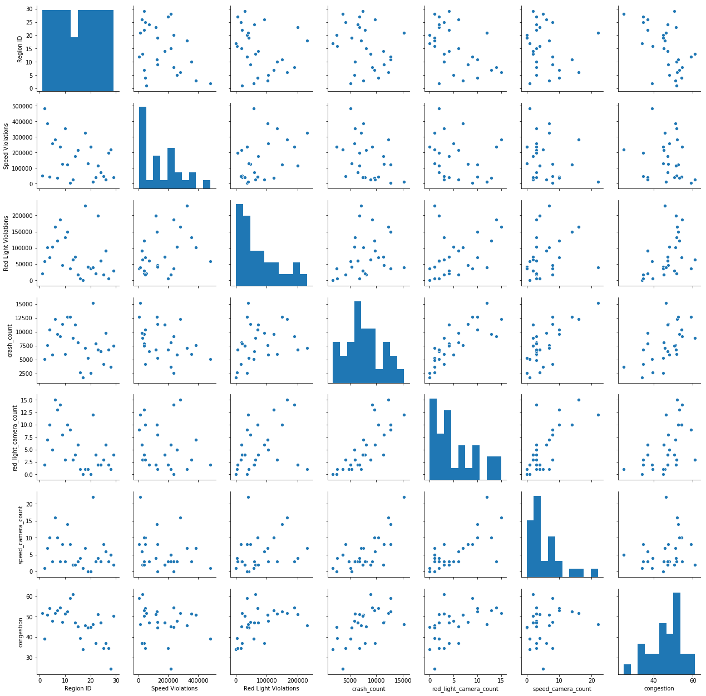
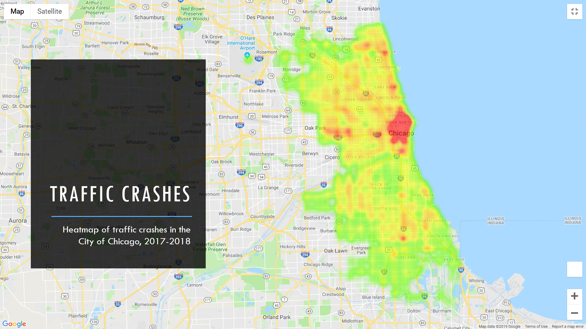
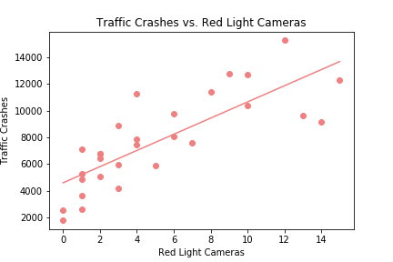
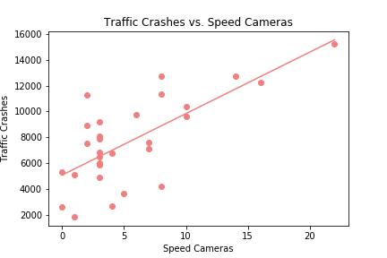
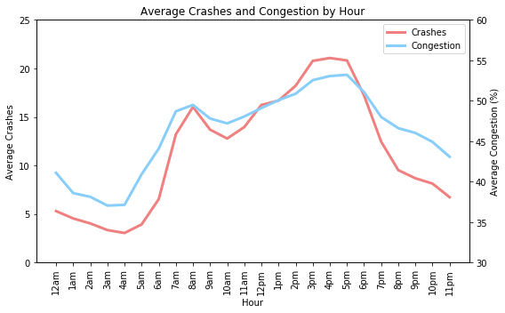
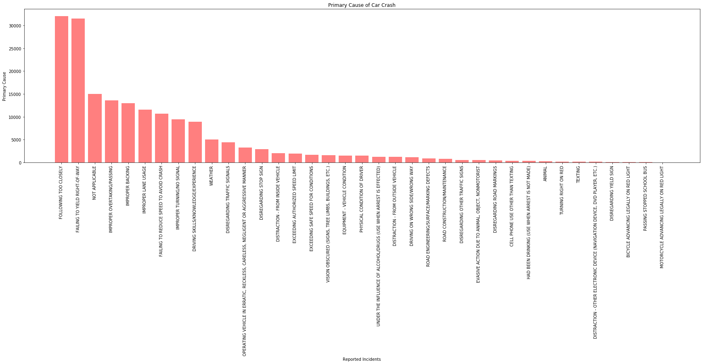
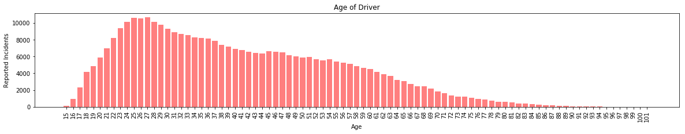
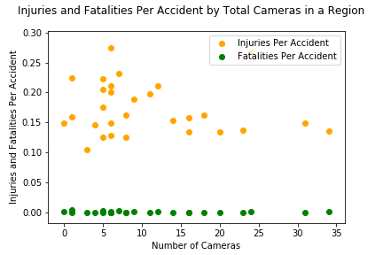
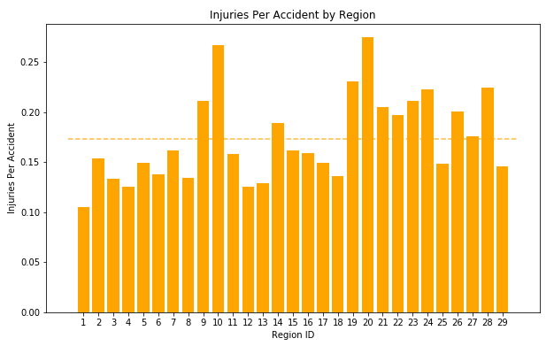
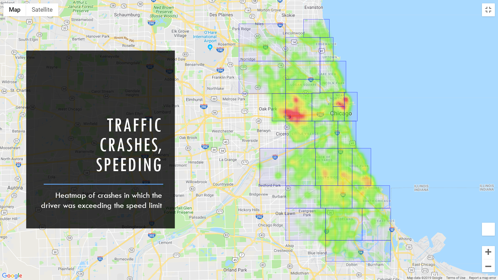

# Traffic Cameras and Public Safety in the City of Chicago  

## Description
Study of traffic in the City of Chicago, including congestion, crash, and traffic camera data, all of which has been made publicly available by the City of Chicago.  

## Data Sources
  * [data.cityofchicago.org](http://data.cityofchicago.org)  
  * www.fhwa.dot.gov  

## Process
* Gather data from data.cityofchicago.org, via the Socrata Open Data API (SODA) or direct .csv download  
* Import and review data using Jupyter Notebook and Pandas  
* Evaluate scope of available data (reporting years, keys to link datasets)  
* Clean datasets  
* Remove NaN and ‘0’ values  
* Filter timeframe of data as needed to remove partial year reporting  
* Parse resulting data, link dataframes to determine answers to the questions posed  
* Visualize data using Matplotlib and Google Maps  
* Run statistical analysis to determine significance  

## Correlation Exploration
* Pair plot using available variables to visualize possible correlation  
* Possible correlation was observed between crash count and red light cameras, as well as crash count and speed cameras  

  

## Questions and Conclusions
**1. In what areas are crashes more/less common?**  

  

**2. Is there a correlation between crashes and red light cameras?  Crashes and speed cameras?**  

  

  There is a strong correlation between number of red light cameras and crashes  
  r = 0.80  
  p = 2.35e-07  

  

  There is a strong correlation between number of speed cameras and crashes  
  r = 0.71  
  p = 1.43e-05  

  Note: Due to lack of available crash data prior to camera installation, not possible to prove causation or effect of camera installation on crash levels  

**3. What is the average congestion level hour by hour?  Does this correlate to the number of crashes?**  

  

  Trend shows higher congestion levels during standard morning and evening commutes, as expected.  There is an extremely strong correlation between congestion and crashes by time of day.  
  r = 0.95  
  p = 6.15e-13  

**4. In what areas are drunk-driving accidents more/less common?**  

  ")

  ")

**5. What is the most common cause of crashes?  What age driver is most likely to be involved in a crash?**  

  

  

  The average age of a driver involved in a crash in Chicago is significantly lower than the average age of all drivers in Illinois.  
  p = 0.0023588  
 
**6. Is there a correlation between cameras and severity of accidents?**  

  

  There is poor correlation in both cases. (r for injuries is -.13, r for fatalities is -.25). Overall the rate of injuries is not dependent on the amount of traffic cameras present in a region.  

  

  

**7. Is speeding a main contributor to crashes and in what areas are accidents involving speeding more/less common?**  

  

## Possible Uses
* Public safety  
  * Identify regions with disproportionately low camera-to-crash ratio and install additional cameras accordingly  
* Insurance companies  
  * Identify risk of car crashes in a given region of the city  
* General public  
  * Identify regions with more frequent crashes  
* Law enforcement  
  * Increase DUI enforcement in regions with more crashes involving drunk drivers  

## Repository Contents
* code/  
  * AccidentsInjuriesFatalitiesbyCamera.ipynb  
  * Congestion.ipynb  
  * Crashes_Cameras.ipynb  
  * final_crash_code.ipynb  
  * Heatmaps.ipynb  
  * Region_Polygons.ipynb  
  * speeding_map.ipynb  
* output/  
  * AccidentsPerCamera.png  
  * Accidents_by_Region.png  
  * Accidents_by_Region_Scaled.png  
  * AGE.png  
  * BAC_bargraph.png  
  * Cameras_by_Region.png
  * CIFTotal_Pie.png  
  * Congestion_by_Hour2.png  
  * Crashes_and_Congestion_by_Hour.png  
  * Crashes_by_Hour2.png  
  * Crashes_vs_Red_Light_Cams.png  
  * Crashes_vs_Speed_Cams.png  
  * Crash_Heatmap_offset.png  
  * Crash_Heatmap_w_cams_offset.png  
  * Drunk_Crashes_by_Region_offset.png  
  * FatalitiesPerAccidentPerCamera.png  
  * FatalitiesPerCamera.png  
  * Fatalities_Per_Accident_by_Region.png  
  * Flag_of_Chicago.png  
  * InjuresFatalitiesRedLight.png  
  * InjuriesFatalitiesbyCameras.png  
  * InjuriesFatalitiesSpeedCameras.png  
  * InjuriesPerAccidentPerCamera.png  
  * InjuriesPerCamera.png  
  * Injuries_and_Fatalities_by_Region.png  
  * Injuries_Per_Accident_by_Region.png  
  * Lighting_Conditions_Pie.png  
  * pairplot.png  
  * primary_cause.png  
  * RedlightCamerasBar.png  
  * Regions_Cameras_offset.png  
  * Regions_offset.png  
  * SelectedRegions.png  
  * Slide-Crash_Heatmap_w_cams_offset.png  
  * Slide-Drunk_Crashes_by_Region_offset.png  
  * Slide-Speeding_Crash_Heatmap_offset.png  
  * SpeedCamerasBar.png  
  * SpeedLimit.png  
  * TotalCamerasBar.png  
  * weather_monthly_bar.png  
* resources/  
  * AccidentsInjuriesCamerasSummary.csv  
  * Chicago_Traffic_Tracker_-_Congestion_Estimates_by_Regions.csv  
  * Congestion_by_Region.csv  
  * Crashes_by_hour2.csv  
  * Crashes_Region.csv  
  * Crashes_w_Region_cleaned_filtered.csv  
  * organized_df.csv  
  * RedLightCameraLocations.csv  
  * Red_Light_Cam_Region.csv  
  * region_bac_count.csv  
  * Region_Summary.csv  
  * SpeedCameraLocations.csv  
  * Speed_Cam_Region.csv  
  * Traffic_Crashes_-_Crashes_2017-2018.csv  
* Chicago_Traffic_Safety.pptx  
* Project-1_Report.docx